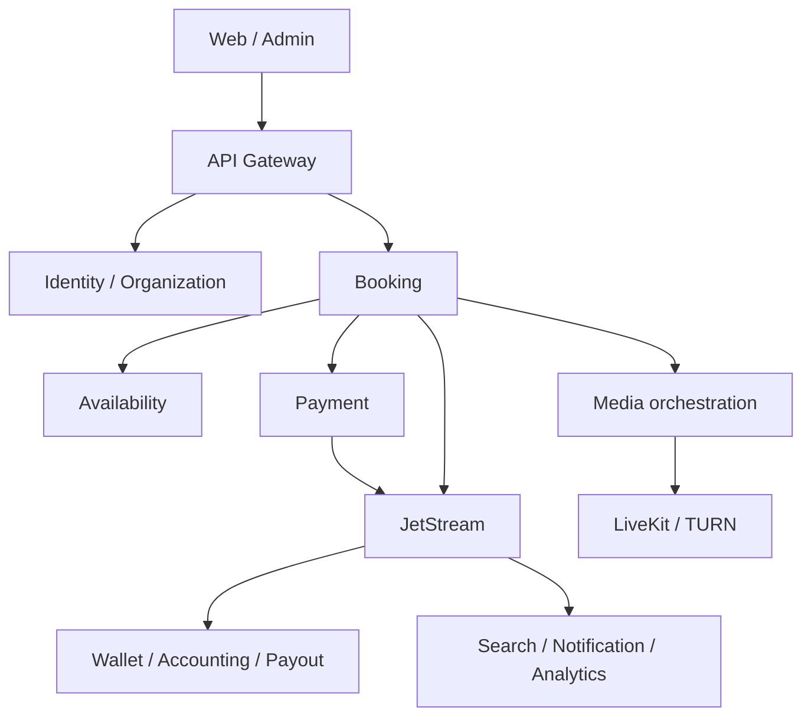

# معماری اجرایی — مرحلهٔ اول

## تصمیم‌های تثبیت‌شده

- دو برنامهٔ مستقل Next.js: `apps/web` برای عمومی، مراجعه‌کننده و استاد؛ `apps/admin` برای پنل‌های کارکنان. هر دو از API Gateway استفاده می‌کنند. استقرار مسیرهای مدیریتی در مرحلهٔ ۲ مشخص می‌شود.
- ۳۲ runtime مستقل NestJS؛ اشتراک فنی در packages بدون Domain Model مشترک.
- PostgreSQL: database، role، migration و backup مستقل؛ cluster مشترک در شروع مجاز است.
- Redis برای cache/presence/lease؛ موفقیت پرداخت و رزرو از cache نتیجه‌گیری نمی‌شود.
- NATS/JetStream برای رویداد پایدار؛ دریافت at-least-once و مصرف idempotent.
- LiveKit/TURN مسئول انتقال رسانه؛ Node فقط orchestration. فایل خصوصی با لینک کوتاه‌عمر.
- OpenSearch و Analytics projection هستند و مستقیم دیتابیس عملیاتی را نمی‌خوانند.
- AI فقط از ai-gateway؛ GapGPT اولین adapter. آدرس، secret reference و شناسهٔ مدل دادهٔ تنظیماتی‌اند.
- Python/FastAPI برای کارهای مرحلهٔ ۱۸، پشت AI Gateway و بدون اتصال مستقل به provider بیرونی.
- تاریخ UTC و timezone از نوع IANA. نمایش جلالی/میلادی فقط لایهٔ ارائه.
- پول: رشتهٔ صحیح در کوچک‌ترین واحد ارز + کد ISO؛ تبدیل ریال/تومان صریح در نمایش.

## مسیرها

## اعتماد و حفاظت داده

Gateway اعتبار اولیه را بررسی می‌کند؛ سرویس مالک داده، permission، membership و tenant scope را مجدداً بررسی می‌کند. tenant دریافتی از header کاربر قابل اعتماد نیست. ارتباط داخلی نیز service identity لازم دارد. دسترسی مدیریتی مجوز پیش‌فرض خواندن مشاوره نیست. رضایت ضبط و AI مستقل و نسخه‌دار است. ورود ناظر شفاف و audit شده است.

## خطا و سازگاری

برای HTTP timeout محدود؛ retry فقط روی عمل idempotent. در Saga شناسه عملیات ثابت، تغییر وضعیت شرطی و جبران تعریف می‌شود. Outbox و دادهٔ دامنه در یک تراکنش، Inbox و اثر مصرف در یک تراکنش؛ ack پس از commit. خطای poison message به صف بررسی منتقل می‌شود. ترتیب از aggregate version کنترل می‌شود، نه زمان شبکه.

## محدودیت مرحلهٔ اول

در این مرحله فقط build، health، قرارداد نمونه و کنترل معماری اجرایی‌اند. اتصال DB/Redis/NATS، auth، مسیریابی واقعی gateway، ثبت trace و migrationهای دامنه هنوز پیاده نشده‌اند. readiness عمداً 503 است تا scaffold به‌عنوان سرویس عملیاتی معرفی نشود. ظرفیت میلیون‌ها کاربر هدف توسعه است، نه ادعای آزمون‌شده.
